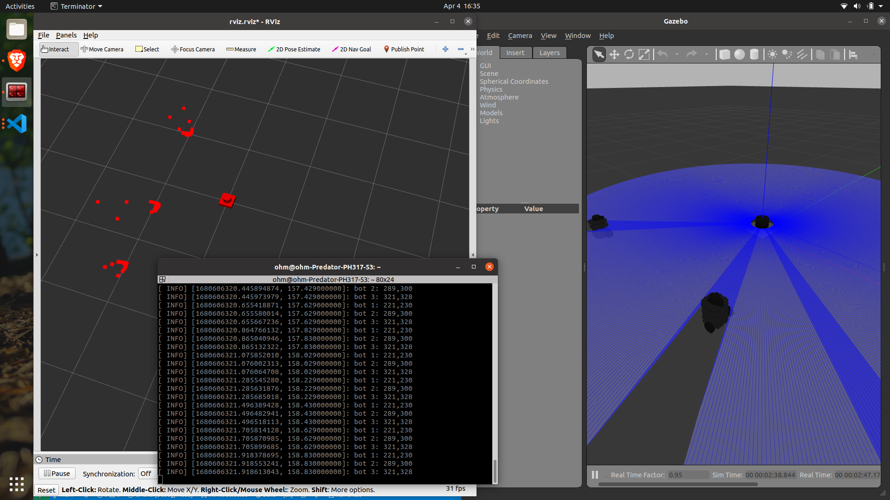

# AccioAssignment
## INFO
- Lidar package contain the LIDIAR bot with scripts to get the distance
## clone this in src folder of your workspace and build package

## To lauch LIDAR and objects write this in command line
```
roslaunch lidar spawn.launch
roslaunch bots bots.launch
```

## To get the distance and angle covered by dynamic objects run following
```
rosrun lidar depthScan
```

